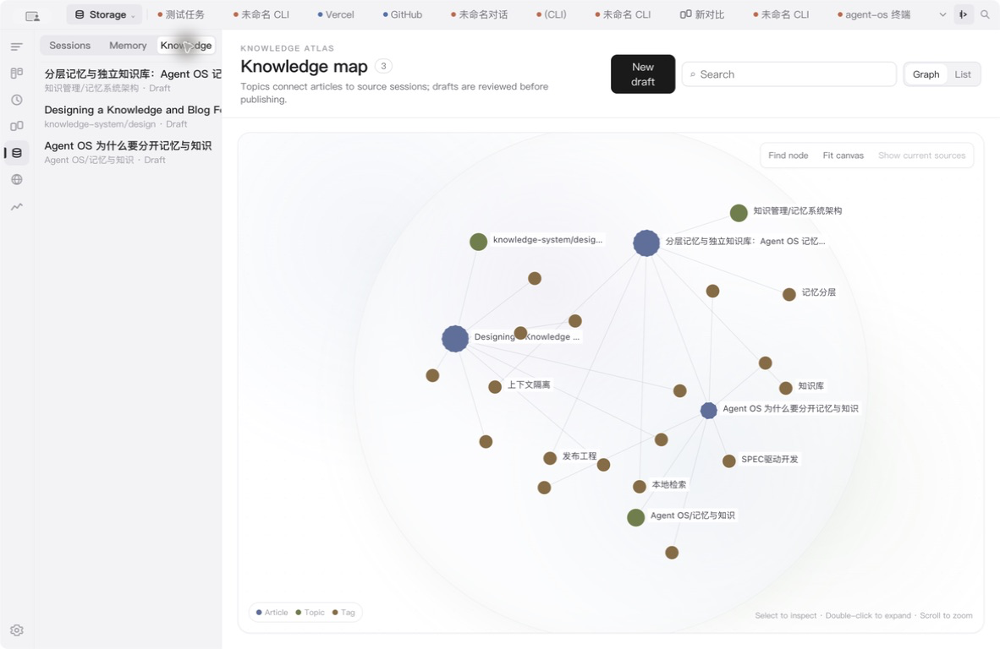
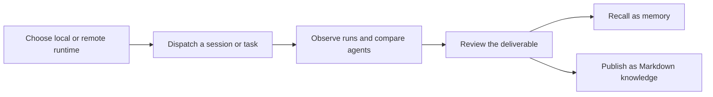
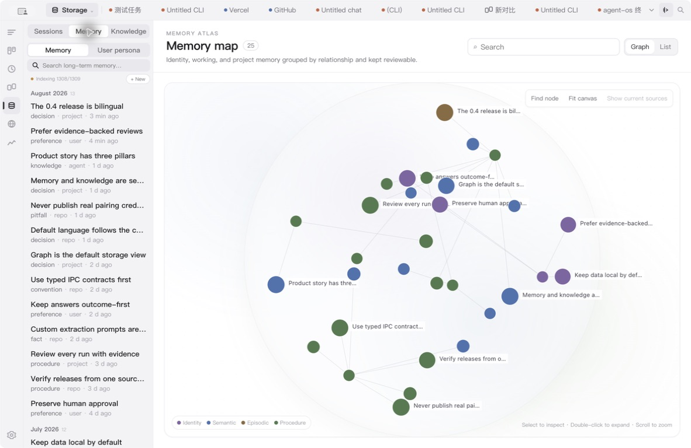

# Agent OS

<p align="center">
  
</p>

<h3 align="center">One workbench for every agent. Continuity for every task.</h3>

<p align="center">
  Run AI coding CLIs locally or on an authorized remote node, review every run with its available evidence, and turn useful work into durable memory and readable knowledge.
</p>

<p align="center">
  <a href="README.zh-CN.md">简体中文</a> ·
  <a href="https://github.com/aiutil/agent-os/releases/latest">Download</a> ·
  <a href="https://agentos.aiutil.com/agent-os-v0.4.0-overview.mp4">100-second product tour</a> ·
  <a href="https://agentos.aiutil.com">Product site</a> ·
  <a href="https://agentos.aiutil.com/guide.html?lang=en">User guide</a>
</p>

<p align="center">
  <a href="https://github.com/aiutil/agent-os/releases/latest"></a>
  <a href="LICENSE"></a>
  
</p>



▶ [Watch the 100-second bilingual product tour](https://agentos.aiutil.com/agent-os-v0.4.0-overview.mp4) — workbench, CLI sessions, compare, tasks, schedules, remote Runtime, message channels, memory, knowledge, and curation settings.

## Why Agent OS

AI CLIs are powerful, but real work quickly spreads across terminal windows, providers, repositories, machines, and half-finished conversations. Agent OS adds the missing workbench layer without replacing the CLIs you already use.

| Run in the right place | Review with evidence | Keep what matters |
| --- | --- | --- |
| Choose a local or authorized remote Runtime Host, CLI, model, workspace, permissions, and session policy. | Track tasks from Todo to Review, inspect attempts and execution events, compare agents side by side, then decide when work is done. | Recall compact, scoped memories during future work and publish longer outcomes as searchable Markdown knowledge. |

## What you can do

- Use Claude, Codex, Gemini, Cursor Agent, OpenCode, Pi, Hermes, and OpenClaw from one desktop workbench when those CLIs are installed and authenticated.
- Keep structured agent sessions and native CLI terminals together, with local search across supported session sources.
- Turn a prompt into a traceable task with separate run records, reviewable final responses, human approval, one-off scheduling, or Cron.
- Compare Web, CLI, and agent panels without repeatedly moving context between applications.
- Run on another computer by pairing another Agent OS desktop or installing a headless Runtime node. Both appear as Runtime Hosts; the managed computer controls the approved capabilities, agents, and folders.
- Reach installed agents through supported message channels while each agent keeps its own persistent session.
- Manage layered memory separately from long-form knowledge. Knowledge articles are real Markdown files with topics, tags, sources, drafts, publishing, local comments, and favorites.
- Switch the desktop UI and built-in memory/knowledge extraction prompts between English and Simplified Chinese. “Follow system” is the default.

## A workflow that survives the chat window



Memory and knowledge deliberately serve different jobs:

- **Memory** is compact, scoped, ranked context that may be recalled for an agent turn.
- **Knowledge** is long-form material for people to read. It is not injected into prompts unless explicitly selected as a reference.

### Memory graph



## Local-first, with explicit boundaries

Session metadata, tasks, indexes, preferences, memory, and knowledge stay on the local machine by default. Model requests follow the behavior and authorization of the CLI and provider you choose. Remote Runtime access is directional, scoped, revocable, and does not imply unrestricted machine access.

Production builds enable anonymous product analytics by default when a Mixpanel token is configured. It uses a random local install ID, allowlisted feature events, and fully masked interaction replay; prompts, replies, terminal content, file paths, credentials, usernames, and email addresses are excluded. Disable it at any time in **Settings → General → Privacy and analytics**.

Agent OS does not sign you into third-party CLIs or bypass their account, subscription, OAuth, API-key, or usage policies.

## Install v0.4.0

Download the build for macOS, Windows, or Linux from the [v0.4.0 release](https://github.com/aiutil/agent-os/releases/tag/v0.4.0).

The macOS build is not notarized by Apple. Download it only from the official Release and verify the published SHA-256 digest and source provenance before using **System Settings → Privacy & Security → Open Anyway**.

See the [user guide](https://agentos.aiutil.com/guide.html?lang=en) for installation, CLI prerequisites, remote Runtime setup, and data behavior.

## Develop locally

Requirements: Node.js 22, npm, and the native build toolchain required by Electron dependencies.

```bash
npm ci
npm run dev
```

Before submitting a change:

```bash
npm run typecheck
npm test
npm run lint
npm run build
```

The Electron application lives in `src/`, packaging and release tooling in `scripts/`, and the static bilingual product site in `site/`.

## Security

Report vulnerabilities privately through [GitHub Security Advisories](https://github.com/aiutil/agent-os/security/advisories/new), not a public issue. See [SECURITY.md](SECURITY.md) for scope and handling.

## License

Apache License 2.0. Third-party components remain under their respective licenses; see [NOTICE](NOTICE).
