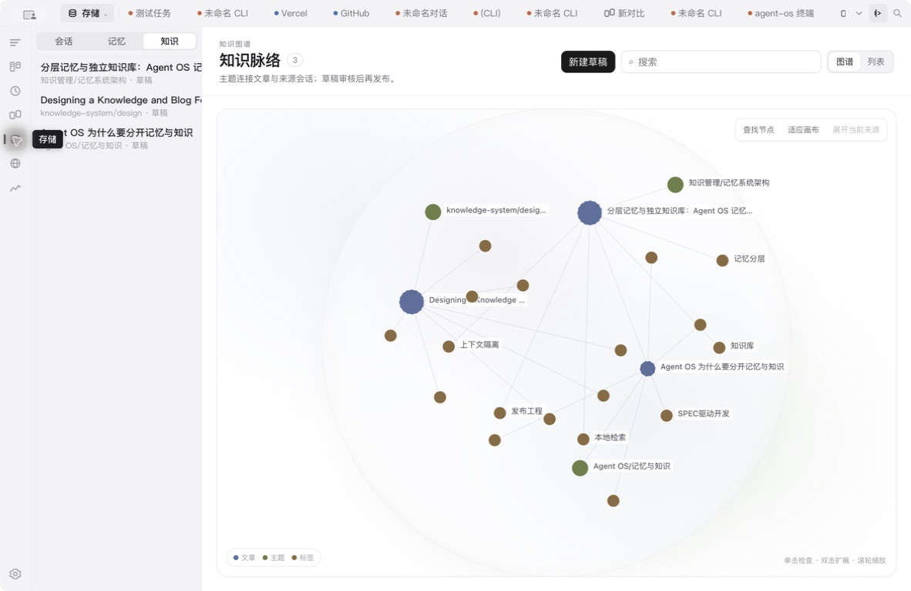
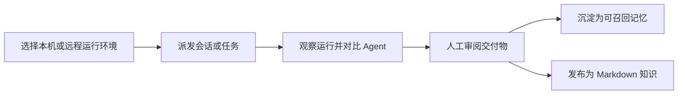
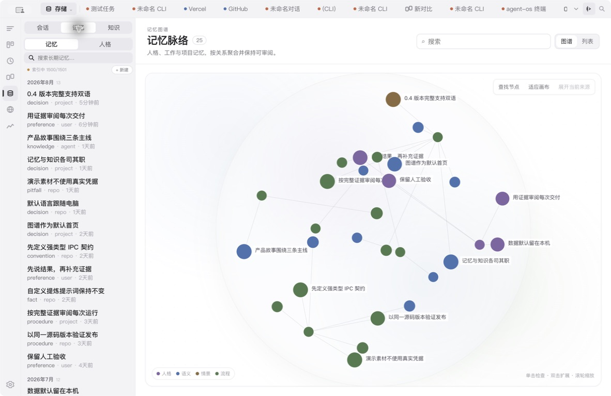

# Agent OS

<p align="center">
  
</p>

<h3 align="center">让每个 Agent 在一个工作台协作，让每次工作持续积累。</h3>

<p align="center">
  在本机或授权远程节点运行 AI 编程 CLI，依据运行记录与可用证据审阅每次执行，再把有价值的工作沉淀为可召回记忆与可阅读知识。
</p>

<p align="center">
  <a href="README.md">English</a> ·
  <a href="https://github.com/aiutil/agent-os/releases/latest">下载</a> ·
  <a href="https://agentos.aiutil.com/agent-os-v0.4.0-overview.mp4">约 100 秒完整演示</a> ·
  <a href="https://agentos.aiutil.com">产品站</a> ·
  <a href="https://agentos.aiutil.com/guide.html?lang=zh">使用指南</a>
</p>

<p align="center">
  <a href="https://github.com/aiutil/agent-os/releases/latest"></a>
  <a href="LICENSE"></a>
  
</p>



▶ [观看约 100 秒中英文完整产品演示](https://agentos.aiutil.com/agent-os-v0.4.0-overview.mp4)——覆盖工作台、CLI 会话、对比、任务、定时、远程 Runtime、消息渠道、记忆、知识与提炼设置。

## 为什么需要 Agent OS

AI CLI 很强，但真正的工作很快就会散落到终端窗口、不同厂商、多个仓库、多台电脑和中断的会话里。Agent OS 在不替代现有 CLI 的前提下，补上统一工作台这一层。

| 在正确的位置运行 | 用证据审阅 | 把成果留下来 |
| --- | --- | --- |
| 选择本机或已授权远程 Runtime Host，并明确 CLI、模型、工作目录、权限和会话策略。 | 让任务从 Todo 走到 Review，检查每次尝试和执行事件，并排比较多个 Agent，最后由人判断是否完成。 | 后续任务可召回短小、带作用域的记忆；较长的成果则发布为可搜索、可阅读的 Markdown 知识。 |

## 你可以用它做什么

- 在已安装并完成授权的前提下，从一个桌面工作台使用 Claude、Codex、Gemini、Cursor Agent、OpenCode、Pi、Hermes 和 OpenClaw。
- 把结构化 Agent 会话与原生 CLI 终端放在一起，并在本机搜索受支持来源的历史会话。
- 把一次提示变成可追踪任务：分别保留每次运行记录，在 Agent 产出最终回复后进入交付物审阅，并由人工验收；也可设置单次计划或 Cron。
- 并排比较 Web、CLI 与 Agent 面板，减少在应用之间反复搬运上下文。
- 通过配对另一台 Agent OS 桌面端，或安装无界面的 Runtime 节点，在其他电脑上运行。两种方式都会成为 Runtime Host；受托管电脑决定开放哪些能力、Agent 与目录。
- 从受支持的消息渠道访问已安装 Agent，同时保留每个 Agent 自己的持久会话。
- 分开管理记忆与知识。知识文章是真实 Markdown 文件，支持主题、标签、来源、草稿、发布、本机评论和收藏。
- 在简体中文与英文之间切换桌面 UI 和内置记忆/知识提炼提示词；默认“跟随系统”。

## 一条不会随聊天窗口消失的工作链



记忆与知识承担不同职责：

- **记忆**是短小、带作用域、可排序的上下文，可在后续 Agent 回合中按需召回。
- **知识**是面向人阅读的长篇内容。只有显式选择“作为当前任务参考”时，才会进入提示词上下文。

### 记忆图谱



## 本地优先，边界明确

会话元数据、任务、索引、偏好、记忆和知识默认保存在本机。模型请求是否发送到外部服务，取决于所选 CLI、模型服务商和用户授权。远程 Runtime 的访问是单向、限定范围且可撤销的，不代表开放整台电脑。

生产制品在配置 Mixpanel token 时默认启用匿名产品分析，只使用本机随机安装标识、白名单功能事件和全量遮罩的交互回放；不会发送提示词、回复、终端内容、文件路径、凭据、用户名或邮箱。可随时在 **设置 → 通用 → 隐私与分析** 中关闭。

Agent OS 不会代替第三方 CLI 登录，也不会绕过它们的账号、订阅、OAuth、API Key 或使用政策。

## 安装 v0.4.0

请从 [v0.4.0 Release](https://github.com/aiutil/agent-os/releases/tag/v0.4.0) 下载适用于 macOS、Windows 或 Linux 的制品。

macOS 制品未经过 Apple 公证。请仅从官方 Release 下载，并先核对公开的 SHA-256 摘要与源码 provenance；确认无误后，再前往 **系统设置 → 隐私与安全 → 仍要打开**。

安装步骤、CLI 前置条件、远程 Runtime 配置和数据行为请查看[完整使用指南](https://agentos.aiutil.com/guide.html?lang=zh)。

## 本地开发

需要 Node.js 22、npm，以及 Electron 原生依赖所需的编译工具链。

```bash
npm ci
npm run dev
```

提交变更前运行：

```bash
npm run typecheck
npm test
npm run lint
npm run build
```

Electron 应用位于 `src/`，构建与发布工具位于 `scripts/`，双语静态产品站位于 `site/`。

## 安全问题

请通过 [GitHub Security Advisories](https://github.com/aiutil/agent-os/security/advisories/new) 私下报告漏洞，不要创建公开 Issue。处理范围与方式见 [SECURITY.md](SECURITY.md)。

## 开源协议

本项目采用 Apache License 2.0。第三方组件仍适用各自许可证，详见 [NOTICE](NOTICE)。
