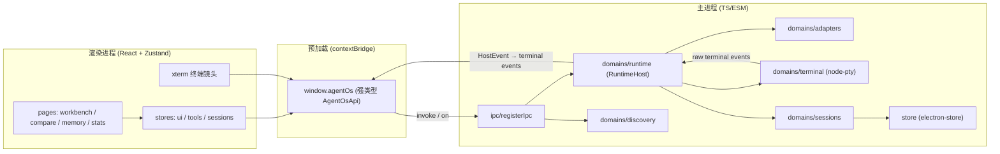

# 架构设计

> 版本：2026-06-12 · 对应 SPEC-000/001

## 1. 三进程架构



数据流要点：
- 渲染端只通过 `window.agentOs`（preload 暴露）访问主进程，契约定义在 `src/shared/ipc-contract.ts`。
- 主进程 IPC handler 薄，业务在 `domains/`。
- Claude/Codex/Hermes/Pi 文件会话与 OpenCode SQLite 会话先归一为
  `NormalizedTranscript`，再写入统一 `sessions/messages`；统计与成长禁止读取私有格式旁路。
- 会话生命周期与终端操作统一经 `RuntimeHost`；当前为主进程内
  `InProcessRuntimeHost`，后续可替换 daemon 实现。
- 终端输出/状态先归一为 `HostEvent`，再由主进程映射为既有 IPC 事件，渲染端订阅刷新。

## 2. 核心数据结构（见 `src/shared/types`）

- **DiscoveryResult** — 一个 CLI 的发现结果（health / executablePath / version / evidence[] / suggestedFixes[]）。
- **CliAdapter** — 统一驱动协议（id / executable / versionArgs / parseVersion / buildLaunchCommand）。
- **TerminalRunState** — 结构化运行状态（status / backend / outputTail / exitCode），薄状态层。
- **WorkbenchSession** — 持久化会话元数据（与实时 PTY 解耦，含 terminalSessionId）。
- **WorkbenchSessionView** — 元数据 ⊕ 实时状态合并的渲染视图（status 决定卡片状态点）。
- **RuntimeHost / HostEvent** — 运行时宿主协议与统一事件信封；隔离 IPC 与具体 PTY 宿主。

## 3. IPC 契约总览（`CHANNELS` / `EVENTS`）

| 域 | invoke channel | 说明 |
|----|---------------|------|
| app | getPlatformInfo / completeOnboarding | 平台信息、引导完成 |
| discovery | scan / get | 扫描全部/单个 CLI |
| runtime | hostStatus | 当前运行时宿主模式、协议版本与会话数 |
| session | list / listViews / create / update / remove | 会话 CRUD + 视图 |
| terminal | write / resize / history / state / states / close | PTY 交互与状态 |

| 事件 | 载荷 | 触发 |
|------|------|------|
| terminal:data | { sessionId, data } | PTY 有输出 |
| terminal:exit | { sessionId, exitCode } | PTY 退出 |
| terminal:stateChanged | { sessionId, state, prevStatus } | 状态迁移 |
| discovery:refresh | DiscoveryResult[] | 后台重扫（预留） |

## 4. 终端状态机

```
starting --data--> running --idle(≥8s)--> waiting_input --data--> running
running  --exit(0)--> completed
running  --exit(≠0)--> failed
*        --close--> disconnected --(30s)--> 清理
```

纯状态机在 `domains/terminal/run-state.ts`（无 native 依赖，可单测）；PTY 生命周期在 `manager.ts`（node-pty + child_process 兜底）。

## 5. 会话 vs 终端解耦

`WorkbenchSession`（持久化元数据）与实时 PTY（`TerminalRunState`，内存）分离：会话通过 `terminalSessionId` 关联当前活跃 PTY，PTY 退出后元数据仍保留，为 SPEC-006 resume 铺路。

## 6. RuntimeHost 分层

`domains/runtime/` 负责会话编排与终端宿主协议。`registerIpc.ts` 不直接访问
session store、adapter registry 或 `TerminalManager`，只委托 `RuntimeHost`。
Step A 使用 `InProcessRuntimeHost` 保持现有进程拓扑和行为；SPEC-014 Step B
将以同一接口替换为 daemon sidecar。
